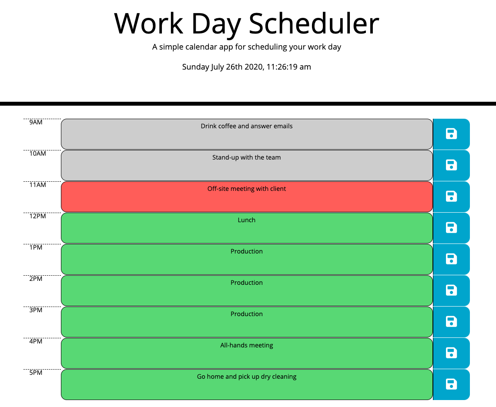

# Work Day Planner

This is a simple day-calendar application that allows usuers to plan out their day hour by hour. 

The user types a task into the selected our and then clicks the save button to the right of the row. The task is then saved locally and will stay there until cleared by the user.

Moment.js was used to dynamically update the date and time at the top. The rows also use Moment.js to update colors based on what time it is. Gray indicates the hour has passed, red indicates the current hour, and green indicates a future hour. 

Site URL: 

